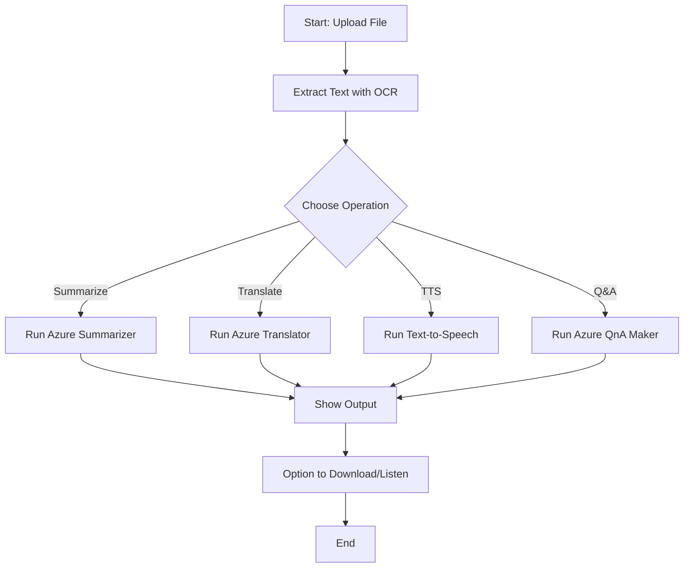

# 🤖 EduBot AI – A Multimodal AI Assistant for Students & Educators

**Microsoft x Edunet Foundation Internship Project – June 2025**

**EduBot AI** is a smart, multimodal assistant built using Azure AI and Generative AI to support students and educators. It helps extract, summarize, translate, vocalize, and generate questions from educational content using AI services like Azure Vision, Language, and Speech APIs. The application is developed using Python and Streamlit.

---

## 🎯 Features

- 📤 **Image & Document Upload:** Extract text using OCR (Azure Vision).
- 🧠 **Summarization:** Condense long content using AI-powered summarizer.
- 🌐 **Translation:** Translate content into various languages using Azure Translator.
- 🔊 **Text-to-Speech:** Convert text into speech in multiple languages.
- ❓ **Question Generator:** Generate comprehension questions from academic text.
- 🎛️ **Clean UI:** Easy-to-use interface for all age groups, powered by Streamlit.

---
## 🧠 System Workflow

1. **Start:** User uploads an image or text.
2. **OCR (if image):** Text is extracted using Azure Vision OCR.
3. **Choose Operation:**
   - Summarize
   - Translate
   - Text-to-Speech (TTS)
   - Question Generation
4. **Processing:** Azure AI services process the selected operation.
5. **Results:** Outputs are displayed on the interface.
6. **Optional:** User can listen to or download the result.


## 📁 Project Structure

```plaintext
EduBot-AI/
│
├── app.py                     # Main Streamlit app
├── requirements.txt           # List of Python dependencies
├── README.md                  # Project documentation
├── utils/
│   ├── ocr.py                 # OCR functionality using Azure Vision
│   ├── summarizer.py          # Text summarization module
│   ├── translator.py          # Language translation module
│   ├── tts.py                 # Text-to-Speech converter
│   └── qna.py                 # Question generation module
├── assets/                    # Static assets and sample images
└── .gitignore
```

System Workflow (Flowchart)
This flowchart outlines the step-by-step process followed by the EduBot-AI application, from input to output using Azure AI services.



---
🧩 Technologies Used
Microsoft Azure AI – Vision, Language, Speech, Translation

Python – Core programming language

Streamlit – For web UI

OpenAI / Hugging Face Transformers – (for optional model tuning)

OCR / NLP / TTS / Q&A – AI capabilities used

---

❗ Troubleshooting
🔑 Azure API Key Issues
Ensure that your Azure API keys are correctly set in your environment variables or configuration file.

Verify that the keys correspond to an active subscription and correct Azure region.

🚫 Streamlit Not Launching
Make sure your virtual environment is activated before running the app.

Run pip install -r requirements.txt to ensure all dependencies are installed.

⚠️ Model or API Failures
Double-check your Azure service endpoint URLs and resource names.

Confirm your subscription level includes access to the required Azure AI services.

Ensure stable internet connectivity and that you're not exceeding rate limits or quotas.

---

🤝 Contributing
You’re welcome to fork this repository and contribute!
Feel free to open issues or pull requests for improvements or new features.

---

📄 License
This project is licensed under the MIT License. See the LICENSE file for more information.

---

✨ Acknowledgment
This project was developed as part of the Generative AI Internship by Edunet Foundation in collaboration with Microsoft.
It reflects learnings from beginner to advanced modules in AI, vision, translation, and responsible AI practices.
---

📌 Author
Harshit Gupta
B.Tech Mechanical Engineering | Kamla Nehru Institute of Technology, Sultanpur
Email: harshitgupta.knit@gmail.com


